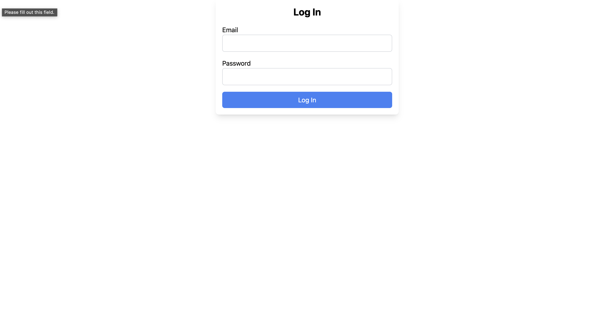

# Skills Management App

This is a React-based web application that allows users to manage their skills and accomplishments. The app supports categorizing skills, adding descriptions, dates, and managing the data with Firebase Firestore as the backend. It also includes user authentication to protect certain routes.

## Table of Contents

- [Features](#features)
- [Installation](#installation)
- [Usage](#usage)
- [Firebase Configuration](#firebase-configuration)
- [Project Structure](#project-structure)
- [Contributing](#contributing)
- [License](#license)

## Features

- **Add Skills**: Users can add new skills with categories, subcategories, descriptions, and optional dates.
- **Display Skills**: Skills are displayed in a categorized format, with search and filter options.
- **Delete Skills**: Users can delete existing skills.
- **User Authentication**: Secure authentication using Firebase Auth, with protected routes.
- **Responsive Design**: The app is fully responsive and works across different screen sizes.

## Screenshots

### Login Page


### App Page


### Home Page


## Installation

1. **Clone the repository:**

   ```bash
   git clone https://github.com/your-username/skills-management-app.git
   cd skills-management-app
   ```

2.	**Install dependencies:**
    ```bash
    npm install
    ```

3. **Set up Firebase:**
   - Create a Firebase project.
   - Add a Firestore database.
   - Set up Firebase Authentication.
   - Copy the Firebase configuration to a `.env` file (see [Firebase Configuration](#firebase-configuration)).

4. **Run the application:**
   ```bash
   npm start
   ```

The app will be available at http://localhost:3000.

## Firebase Configuration

Create a .env file in the root directory of the project with the following configuration:
    ```env
    REACT_APP_FIREBASE_API_KEY=your_api_key
    REACT_APP_FIREBASE_AUTH_DOMAIN=your_auth_domain
    REACT_APP_FIREBASE_PROJECT_ID=your_project_id
    REACT_APP_FIREBASE_STORAGE_BUCKET=your_storage_bucket
    REACT_APP_FIREBASE_MESSAGING_SENDER_ID=your_messaging_sender_id
    REACT_APP_FIREBASE_APP_ID=your_app_id
    ```

Replace the placeholders with your actual Firebase project credentials.

## Usage

1. **Sign Up/Login:**
   - Users can sign up for an account or log in if they already have one.

2. **Add Skills:**
   - Navigate to `/app` to access the skill management interface.
   - Fill out the form to add a new skill. The skill can be categorized, and a date can be added.

3. **Display Skills:**
   - The skills are displayed in a categorized format, with options to search and filter by category.

4. **Delete Skills:**
   - Click the delete button next to a skill to remove it from the database.

## Project Structure

src
├── /components
│   ├── AddSkills.js
│   ├── DisplaySkills.js
│   ├── Login.js
│   ├── Signup.js
│   ├── SkillsPage.js
│   ├── PrivateRoute.js
├── /firebaseConfig.js
├── /App.js
├── /index.js
└── /AuthContext.js

- **components/**: Contains all the React components used in the app.
- **firebaseConfig.js**: Firebase configuration and initialization.
- **AuthContext.js**: Provides authentication context for the app.
- **App.js**: Main application component.
- **index.js**: Entry point for the React app.